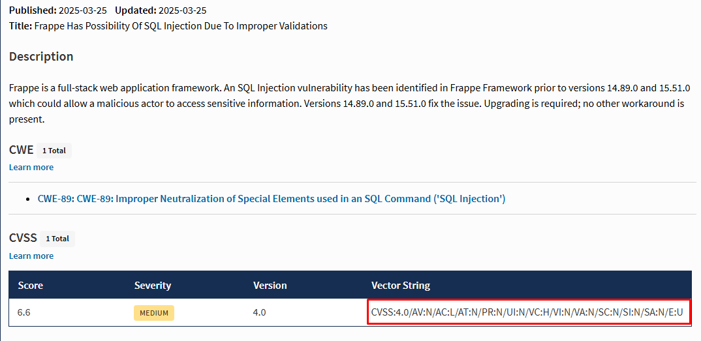
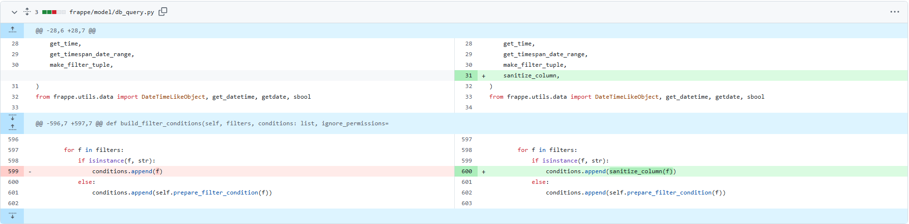
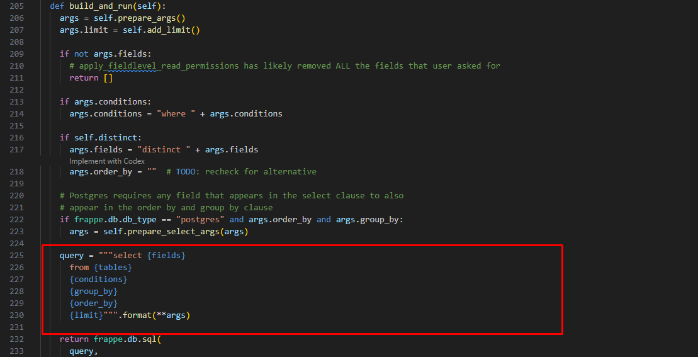
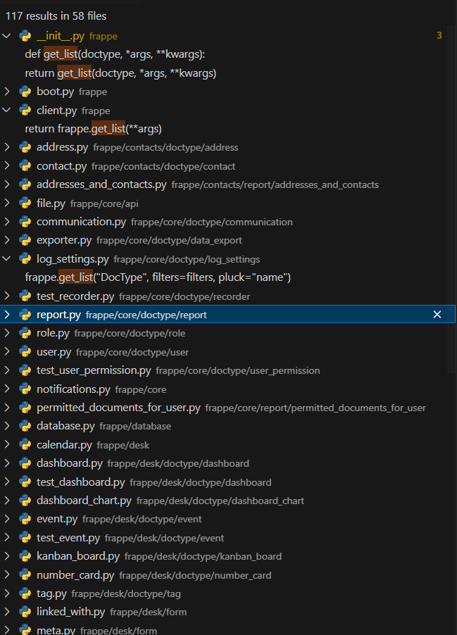
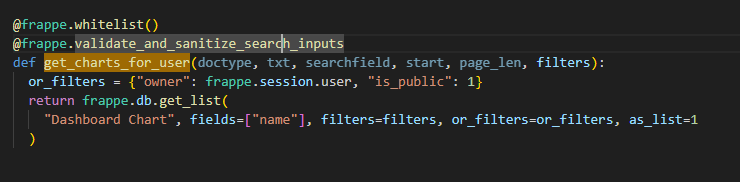
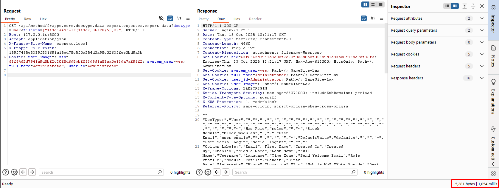
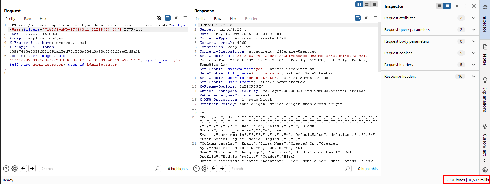
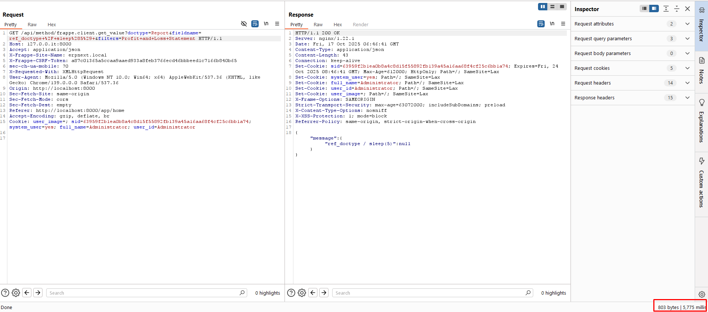
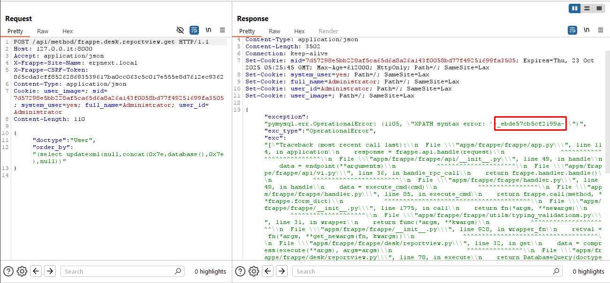

# CVE-2025-30212: SQL Injection

I started by comparing the vulnerable and patched Frappe versions. The challenge used v15.40.0, and this CVE was fixed in v15.51.0. The advisory describes an SQL injection caused by improper validation and lists the attack as requiring no privileges.



The most useful change in the patch was inside `build_filter_conditions()`. Before the fix, when a filter item was a string, Frappe appended it directly to `conditions`. The patch changed that line to pass the string through `sanitize_column()` first.



This immediately narrowed the bug down to string filters. Normal Frappe filters are usually lists or dictionaries, but this branch accepts a raw string and treats it as an already-built condition.

I then followed `conditions` into the final query. In `build_and_run()`, Frappe prepends `where` and interpolates the result into a query template together with `fields`, `tables`, `group_by`, `order_by`, and `limit`.



The vulnerable flow is basically:

```text
string item inside filters
  -> conditions.append(f)
  -> args.conditions = 'where ' + conditions
  -> query.format(**args)
  -> frappe.db.sql(query)
```

At this point, I had the sink but still needed a method that passed user-controlled string filters into `get_list()` or `get_all()`. I searched for their callers across the Frappe source.



One interesting caller was `get_charts_for_user()` in `dashboard_chart.py`. It accepts a `filters` argument and passes it to `frappe.db.get_list()`.



I also tested the data export flow because it let me send a string condition for the `User` DocType. To confirm the injection, I used two time-based conditions:

- One condition evaluated to false, so the delay was not executed.
- The other evaluated to true, so the database executed a five-second sleep.

The false case returned in around one second.



The true case took around sixteen seconds in this request. The total delay was longer than five seconds because the injected condition was evaluated more than once while the export query processed rows.



The generated query in my debugging session showed the injected expression directly after `WHERE`, confirming that the string was being treated as SQL syntax rather than a bound value.

I also found other query parameters reaching similar unsafe construction paths. A manipulated `fieldname` produced a measurable database delay through the filename-related path.



The `order_by` parameter was another injection surface. In this test, I used an error-based expression and the MariaDB XPath error returned part of the database result in the response.



The SQL injection itself was confirmed, but the methods I reproduced required an authenticated session. Despite the advisory showing `PR:N`, I did not find a working Guest path in this setup. My result was an SQL injection reachable by an authenticated user, which could be used to extract Administrator details or a password reset key before moving to the next stage.
