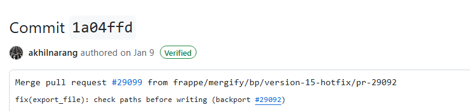
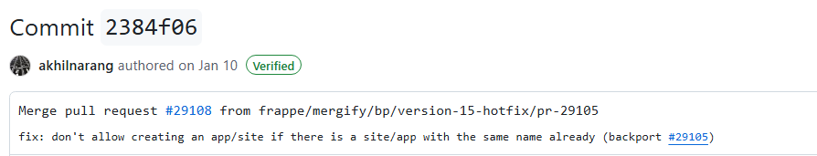
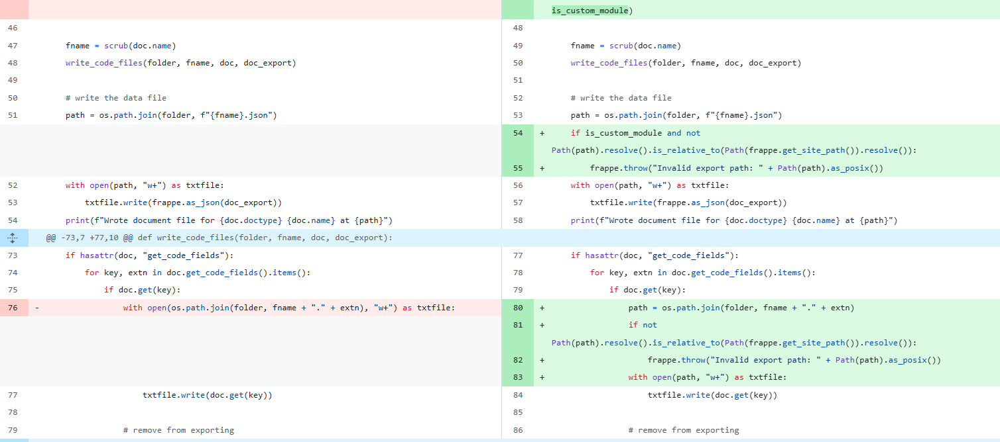
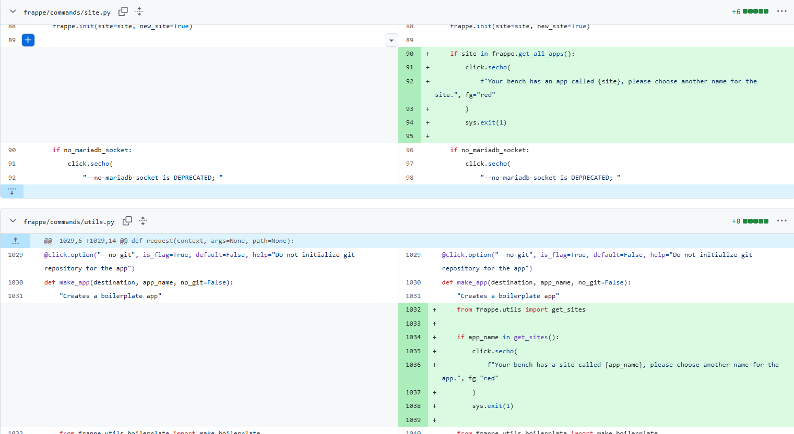
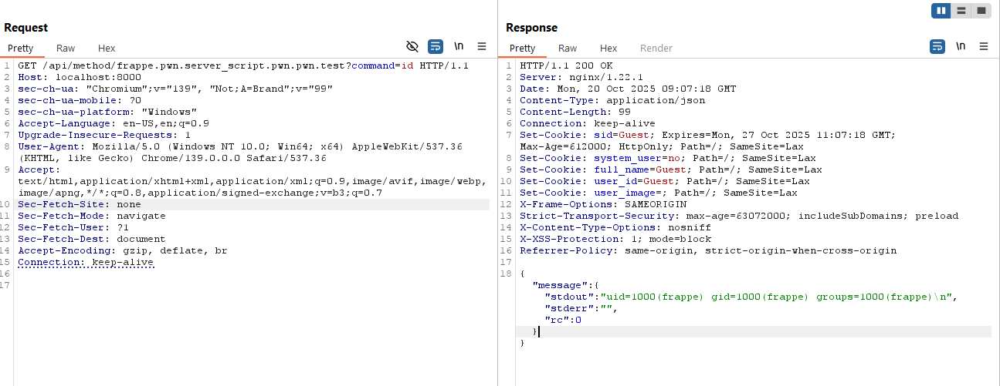
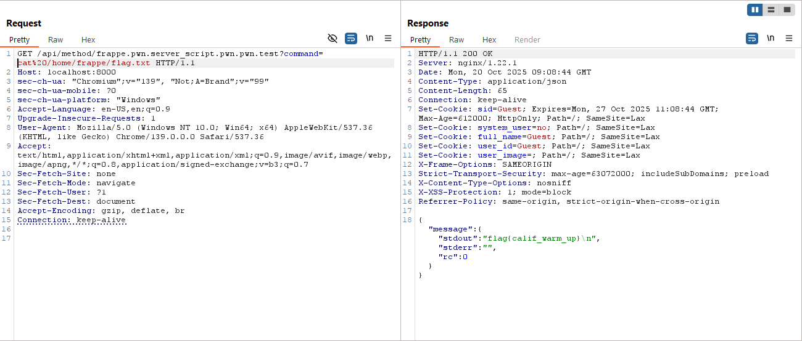
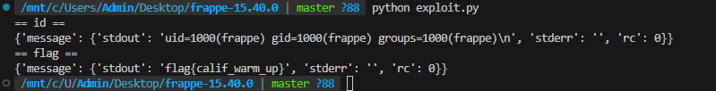

# CVE-2025-30213: Path Traversal to RCE

For this CVE, I started from the patch diff between the affected Frappe version and v15.52.0. Two commits looked directly related to the issue.

The first commit added path checks before writing exported files.



The second commit prevented a site and an app from being created with the same name.



The export patch was the main clue. Before the fix, `write_document_file()` and `write_code_files()` created paths with `os.path.join()` and opened them directly. The patched version resolves the destination and checks that it is still under `frappe.get_site_path()` before writing.



That means the vulnerable version trusted a joined path without checking where it actually resolved. If one of the path components contains `../`, the exporter can leave the site directory and write somewhere else.

The site/app-name patch looked like extra hardening around the same general problem: Frappe was using logical names as filesystem path components, and collisions between those names could create path confusion.



## Finding the writable path

I followed the package export flow and found that `package_name` affects the directory used for exported modules. By setting it to a traversal path, I could escape the normal site location and point the exporter into Frappe's source package under `apps/frappe/frappe`.

The path I used in the lab was based on:

```text
../../../apps/frappe/frappe
```

The flow I traced was:

```text
Package Release publish
  -> export_files
  -> export_modules
  -> export_doc
  -> write_document_file / write_code_files
  -> open(attacker-controlled destination, 'w+')
```

So the first primitive was path traversal leading to an arbitrary file write.

## Turning the file write into RCE

Writing into `apps/frappe/frappe` is useful because that directory is already part of Frappe's Python package. If the exporter creates a valid module there, Frappe can import it through a dotted API path.

I used four Frappe objects for the chain:

1. A **Package** with the traversal value in `package_name`.
2. A **Module Def** named `pwn`, linked to that package and to the `frappe` app.
3. An API-type **Server Script** containing a whitelisted test function.
4. A published **Package Release** to trigger the export.

After publishing, the exported Python file landed at a path equivalent to:

```text
apps/frappe/frappe/pwn/server_script/pwn/pwn.py
```

The matching API route was:

```text
/api/method/frappe.pwn.server_script.pwn.pwn.test
```

When that route was requested, Frappe imported the exported module and called the whitelisted function. This converted the arbitrary file write into code execution.

## Why I needed a System User

The objects used in this flow (`Package`, `Module Def`, `Server Script`, and `Package Release`) are developer/desk DocTypes. A Website User did not have permission to create or publish them in my setup.

This meant the path was not directly reachable from Guest or from a normal low-privilege website account. I needed a System User with enough permissions before I could trigger the export flow.

## Reproducing the chain

I logged in as a System User, created the Package with the traversal path, added the Module Def and API Server Script, then published the Package Release. After the files were written, I called the new dotted API route.

Calling the test method with `id` returned the identity of the Frappe process, confirming that the exported Python code was running on the backend.



I then used the same method to read `/home/frappe/flag.txt`. The flag content came back in the JSON response.



Finally, I ran the full local exploit flow from the terminal. It created the required objects, triggered the export, called the generated endpoint, and returned both the process identity and the flag.



The complete chain I reproduced was:

```text
privileged Frappe account
  -> controlled package_name
  -> path traversal during export
  -> Python file written into the Frappe package
  -> module imported through /api/method/<dotted.path>
  -> remote code execution
```
