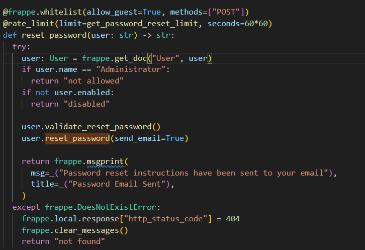
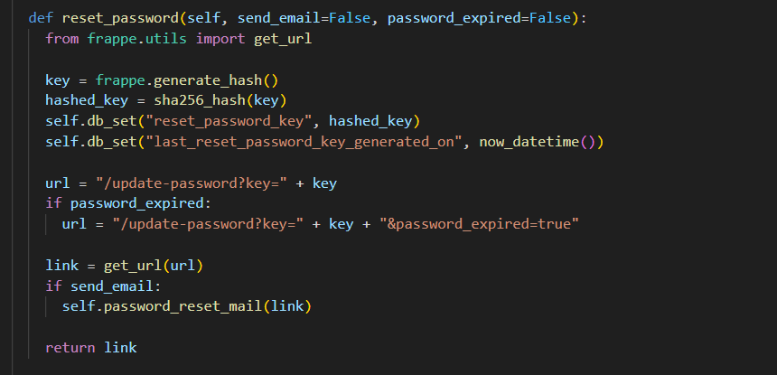
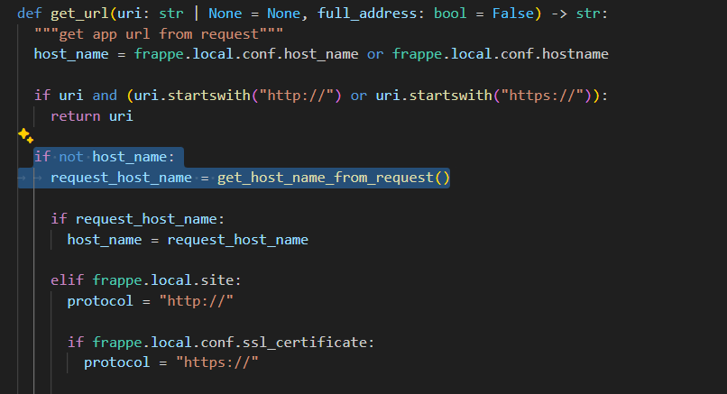
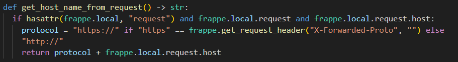
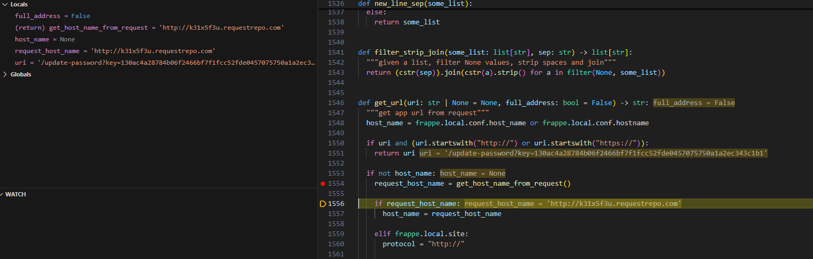
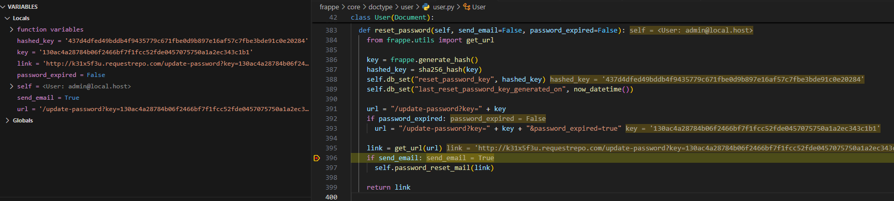
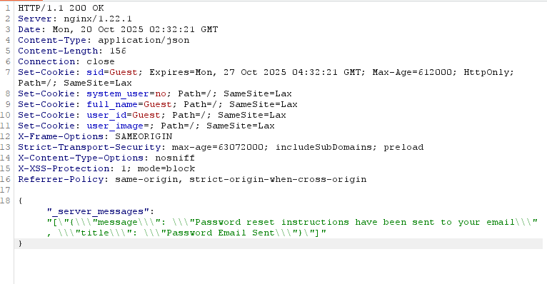

# CVE-2025-52898: Password Reset Poisoning

I found this while looking for the unauthenticated bug in the Frappe challenge. I was going through methods marked with `@whitelist(allow_guest=True)` and checking whether any of them could give me an account without already having a session.

The password reset method stood out because it is available to Guest users and generates a link containing a reset key.



The method loads the requested User document, checks that the account is enabled, then calls `user.reset_password(send_email=True)`. Inside that function, Frappe generates a random key, stores its hash in `reset_password_key`, and builds `/update-password?key=<key>`.



The important line is `link = get_url(url)`. I followed that call because the relative reset path has to be turned into a complete URL before it is emailed.

Inside `get_url()`, Frappe first tries to use `host_name` or `hostname` from the site config. In my setup, neither value was set, so the function fell back to `get_host_name_from_request()`.



`get_host_name_from_request()` builds the origin from `frappe.local.request.host`. That value comes from the incoming HTTP request, so I can control it through the Host header.



The resulting flow is:

```text
Guest reset request
  -> user.reset_password()
  -> get_url('/update-password?key=<reset_key>')
  -> get_host_name_from_request()
  -> attacker-controlled Host + valid reset key
  -> poisoned link sent by email
```

To verify it, I sent a reset request with my callback domain in the Host header and stepped through the code with `debugpy`. At the breakpoint, `host_name` was `None` and `request_host_name` contained my callback URL.



After `get_url()` returned, the final `link` pointed to my domain and still contained the real password reset key. The screenshot also shows that the User object being processed in my lab was `admin@local.host`.



The endpoint returned a normal success response saying that password reset instructions had been sent. Nothing in the response suggested that the Host value had been rejected.



If the user clicks that email link, the browser sends the reset key to the host I supplied. I can then use the captured key to reset the account password.

This was not the CVE-2025-30214 path I was originally trying to find. It also still needs the victim to click the email, so it is not a zero-interaction authentication bypass. After checking the existing Frappe advisories, I found that this behavior had already been reported as CVE-2025-52898.
