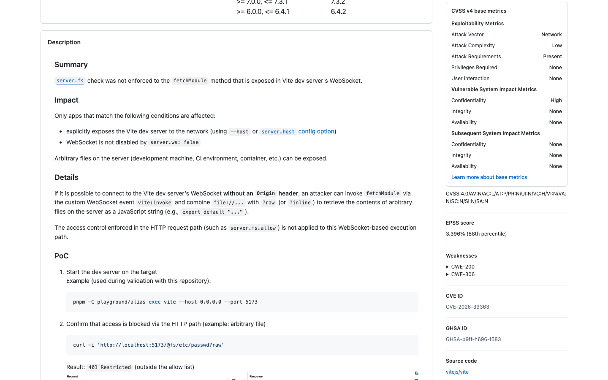
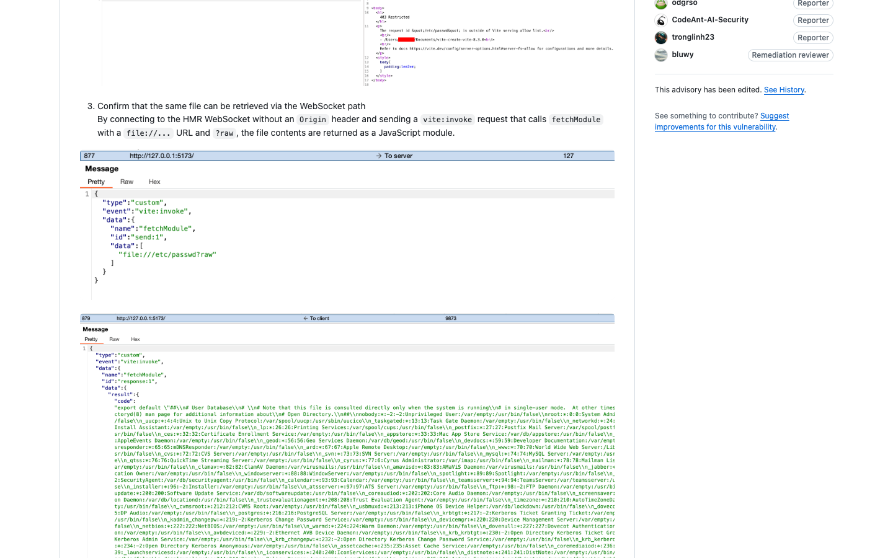
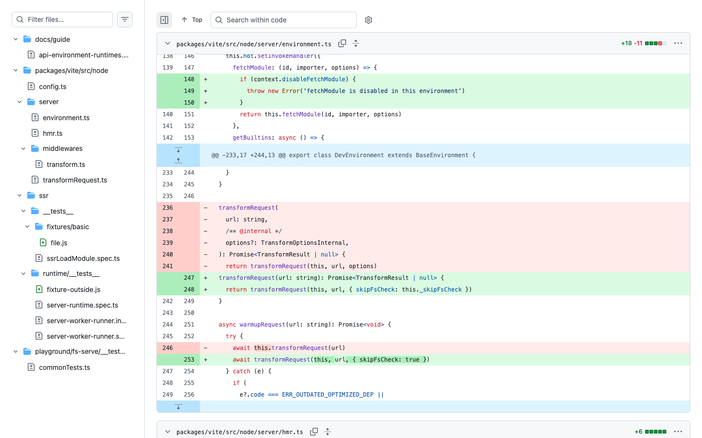
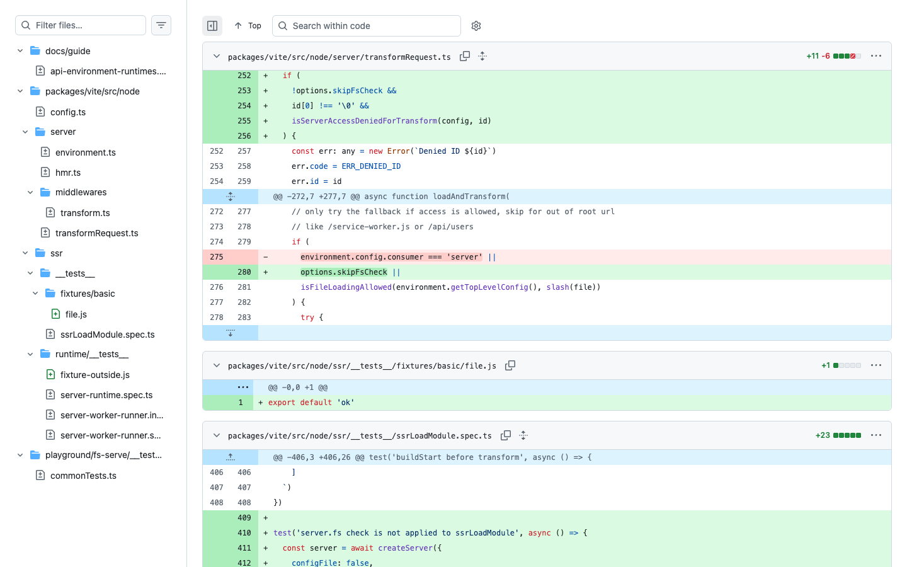

# CVE-2026-39363: Arbitrary File Read in Vite Dev Server

I found this issue by comparing how the Vite dev server handled file access through HTTP and through its HMR WebSocket.

Vite uses `server.fs` rules to limit which local files can be served. Through the normal HTTP route, requesting a file outside the allowlist returned `403 Restricted`, so that path was working as expected.

The HMR WebSocket exposed another route to the same module loading logic. A client could send the custom `vite:invoke` event and invoke `fetchModule`. The filesystem check used by the HTTP middleware was not applied to this WebSocket path.



The vulnerable flow was:

```text
Connection to the HMR WebSocket without an Origin header
  -> vite:invoke event
  -> fetchModule
  -> file URL with the raw or inline query
  -> local file loaded as a JavaScript module
  -> file content returned to the WebSocket client
```

I reproduced it against a Vite dev server exposed with `--host`. First, I requested a file outside the allowed filesystem root through `/@fs/` and received the expected `403` response. I then requested the same file through `fetchModule` over the HMR WebSocket. The response returned the file content inside an `export default` JavaScript string.



The main issue was that the access check lived in the HTTP transform middleware instead of the shared transform path. `fetchModule` reached `transformRequest()` through the environment transport without going through that middleware.

The patch adds controls around `fetchModule` and passes a filesystem-check state into `transformRequest()`.



The actual `server.fs` validation is moved into the shared `loadAndTransform()` path. This makes the check run for module loading over the WebSocket as well as the normal HTTP route. The patch only allows the check to be skipped for transports that are not exposed over the network.



The issue affected setups where the Vite dev server was exposed to the network and WebSocket support was enabled. No authenticated Vite session or victim interaction was required once the attacker could reach the HMR WebSocket.

References:

- [GitHub Advisory](https://github.com/advisories/GHSA-p9ff-h696-f583)
- [Fix commit](https://github.com/vitejs/vite/commit/f02d9fde0b195afe3ea2944414186962fbbe41e0)

