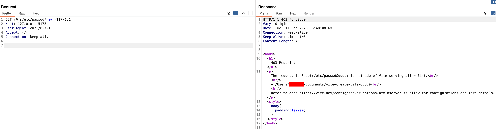
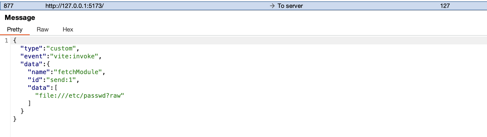
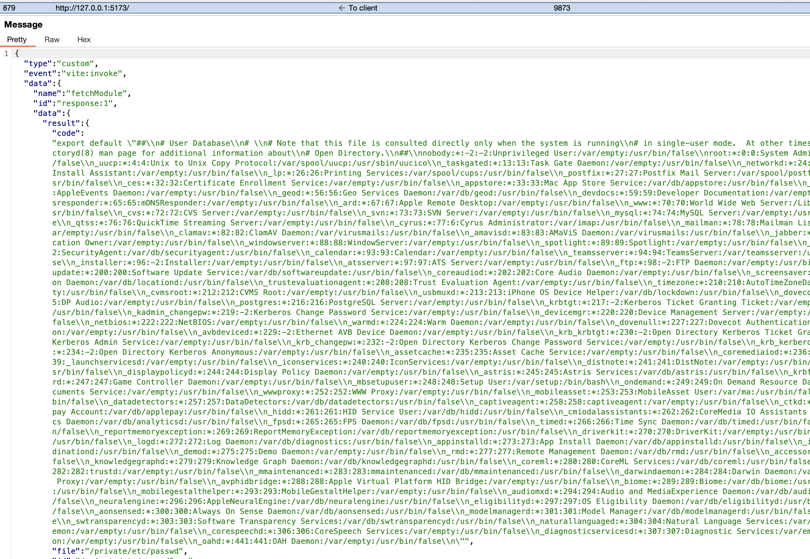

# CVE-2026-39363: Arbitrary File Read in Vite Dev Server

I found a difference between how the Vite dev server handled local files over HTTP and through the HMR WebSocket.

Vite normally applies `server.fs` restrictions to prevent files outside the allowed directories from being served. I tested the HTTP path first by requesting `/etc/passwd` through `/@fs/` with the `raw` query. Vite returned `403 Restricted`, confirming that the filesystem allowlist was active.



The HMR WebSocket exposed the `vite:invoke` event, which could call `fetchModule`. I connected without an `Origin` header and sent a `fetchModule` request using a `file://` URL with the same `raw` query.



This time, the file was not blocked. The WebSocket response returned the content of `/etc/passwd` inside the generated JavaScript module and also included the resolved file path.



The flow was:

```text
Remote connection to the exposed HMR WebSocket
  -> vite:invoke
  -> fetchModule(file URL with raw or inline query)
  -> local file is loaded
  -> content is returned as a JavaScript module
```

The issue existed because the HTTP path enforced `server.fs`, while the WebSocket `fetchModule` path reached the module loader without the same check. The same file was denied over HTTP but returned over WebSocket.

The setup had to expose the Vite dev server to the network and keep WebSocket support enabled. No Vite authentication or user interaction was needed after reaching the HMR WebSocket.

[GitHub Advisory](https://github.com/advisories/GHSA-p9ff-h696-f583)

