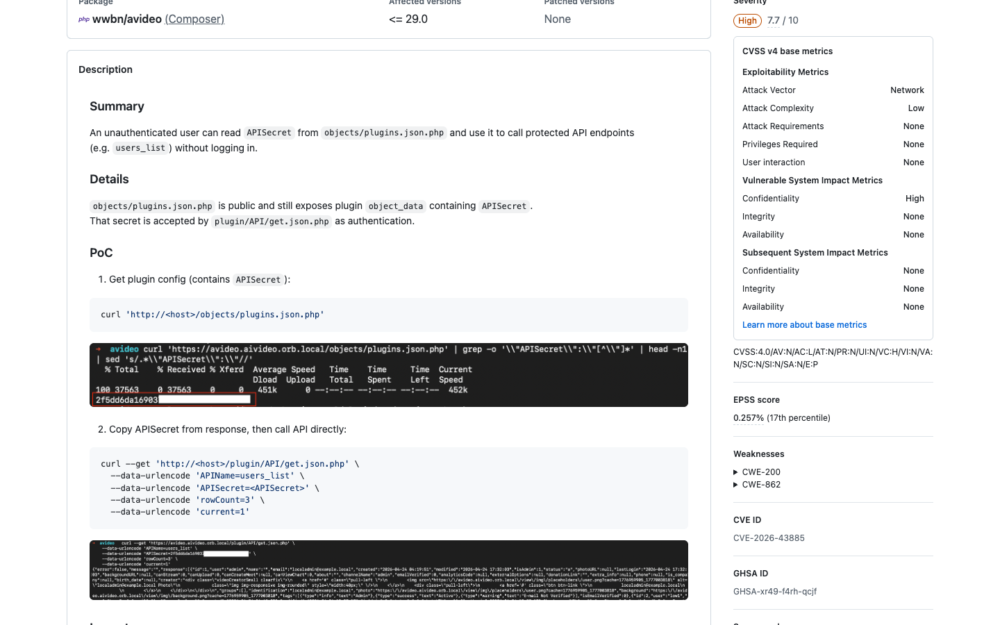
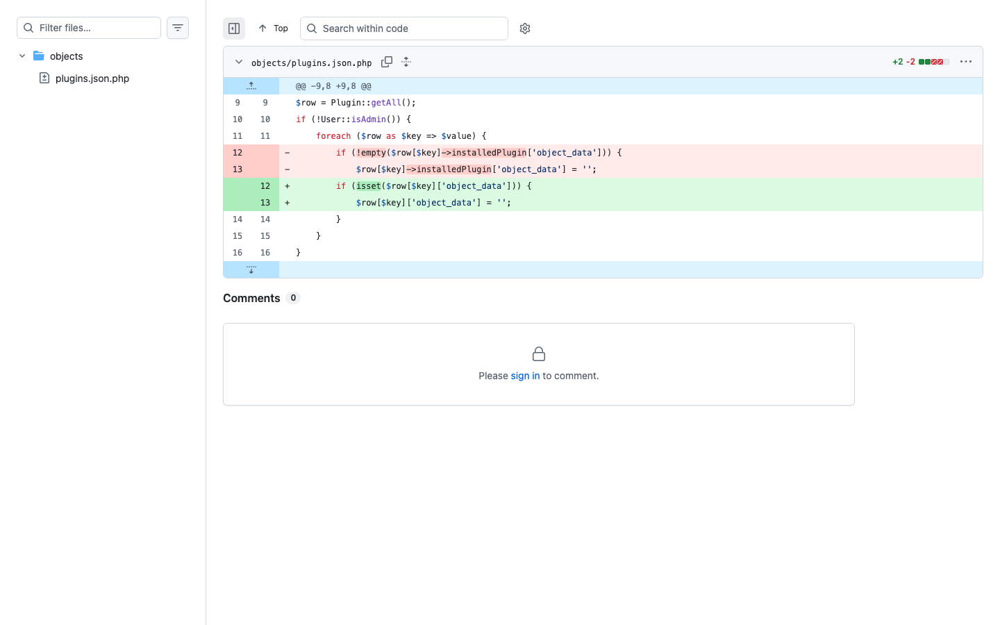

# CVE-2026-43885: API Secret Disclosure in AVideo

I found this issue while reviewing public JSON endpoints in AVideo. The interesting endpoint was `objects/plugins.json.php`, which returns the installed plugin list without requiring authentication.

The response included each plugin's `object_data`. For the API plugin, that object contained `APISecret`, which is supposed to act as the credential for protected API calls.



The endpoint already had logic intended to hide `object_data` from non-admin users, but it accessed the result with the wrong structure:

```text
$row[$key]->installedPlugin['object_data']
```

The data returned by `Plugin::getAll()` stored `object_data` directly inside the row array. Because the check looked at the wrong location, it never removed the sensitive value from the public response.

The actual flow was:

```text
Unauthenticated request to objects/plugins.json.php
  -> Plugin::getAll()
  -> incorrect non-admin filtering
  -> object_data remains in the response
  -> APISecret is exposed
```

I reproduced it by requesting `objects/plugins.json.php` without a session and extracting `APISecret` from the JSON response. I then supplied that value to `plugin/API/get.json.php` with `APIName=users_list`. The API accepted the leaked secret and returned user data without a normal login.

The patch confirms the data structure mistake. It replaces the invalid nested object lookup with a direct array check and clears `$row[$key]['object_data']` for non-admin users.



So the issue was a two-step authentication bypass. A public endpoint leaked the API credential, and another endpoint trusted that credential as authentication.

References:

- [GitHub Advisory](https://github.com/advisories/GHSA-xr49-f4rh-qcjf)
- [Fix commit](https://github.com/WWBN/AVideo/commit/1c36f229d0a103528fb9f64d0a1cc0e1e8f5999b)

