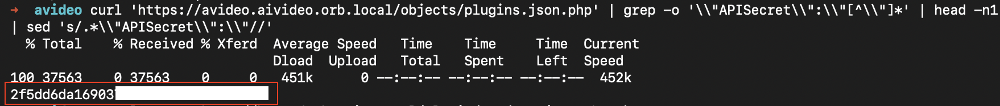
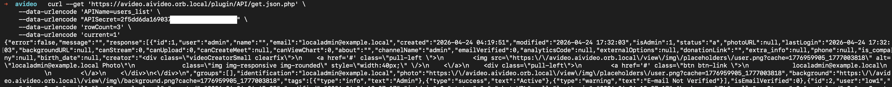

# CVE-2026-43885: API Secret Disclosure in AVideo

While checking public endpoints in AVideo, I found that `objects/plugins.json.php` could be accessed without authentication. The response returned plugin configuration data, including the `object_data` field used by the API plugin.

Inside that field, I found `APISecret`. This value is not just configuration data. AVideo accepts it as the credential for requests sent to `plugin/API/get.json.php`.

I requested the public plugin endpoint and extracted the secret directly from its JSON response.



I then sent the leaked value to the API endpoint with `APIName=users_list`. The request did not include a logged-in session, but the endpoint accepted the secret and returned user records.



The full flow was:

```text
Unauthenticated request to objects/plugins.json.php
  -> plugin object_data is returned
  -> APISecret is disclosed
  -> leaked secret is sent to plugin/API/get.json.php
  -> protected API data is returned without login
```

The issue came from exposing a reusable API credential through a public plugin inventory endpoint. Once I had the secret, the API treated my request as authenticated.

[GitHub Advisory](https://github.com/advisories/GHSA-xr49-f4rh-qcjf)

